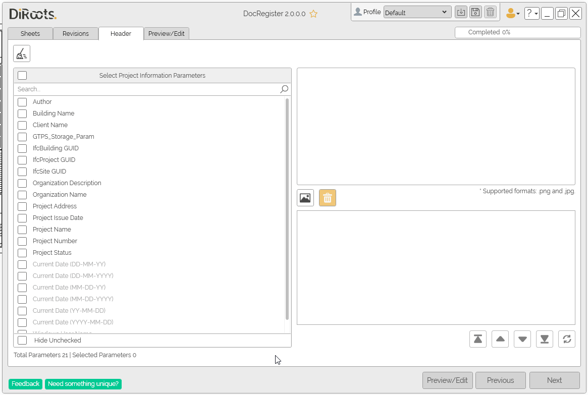
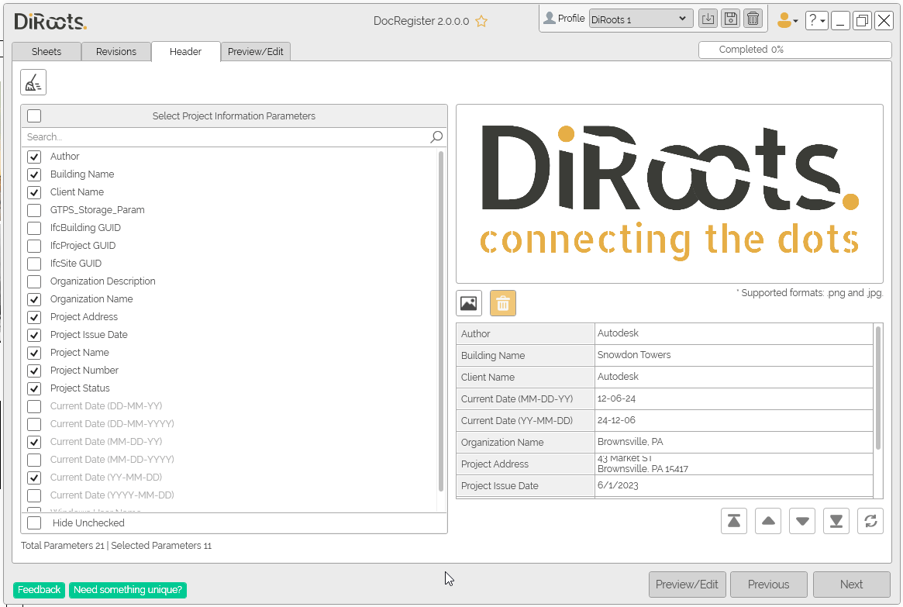
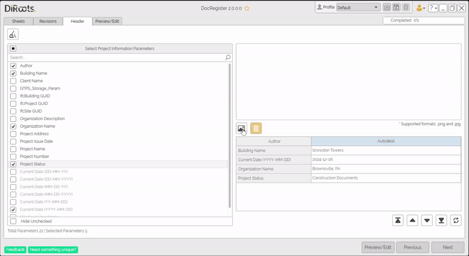

# Headers Tab
{: .no_toc }
In this tab choose the Project Information Parameters to build the document's header and select an image to include in it.

## Table of contents
{: .no_toc .text-delta }

1. TOC
{:toc}

---

## Select Project Information Parameters

In this table, you can select the information parameters to be included in the header section of the document. Use the checkboxes to select the parameters.

Some additional environment variables are appended, displayed in gray, such as Date and Windows User Name.

1. Use the **Search** bar to quickly locate a parameter by name.

2. Use the checkboxes to select the desired parameters.

3. The selected parameters will automatically appear in the **Selected Parameters Table** on the right.

4. To hide the parameters you haven’t selected, check the **Hide Unchecked** box at the bottom of the panel.

  
Note: the version on the image may not reflect the [latest version of DocRegister](https://diroots.com/revit-plugins/revit-to-pdf-dwg-dgn-dwf-nwc-ifc-and-images-with-prosheets/).

## Parameters Preview:

In this table, you can arrange the selected parameters and adjust their display settings:
### Action Buttons

- **Reorder Parameters**: Use the arrow buttons below the table to rearrange the order of selected parameters. The order you set here will determine their placement in the final document.
- **Sort Parameters**: Use the Sort Parameters button to arrange them alphabetically.

### Context Menu
- **Edit Parameter Name**: Override the parameter's name when exporting.
- **Undo Name Change**: Revert the name to the original.
- **Align Left/Right/Center**: Align the text of the column's content.

  
Note: the version on the image may not reflect the [latest version of DocRegister](https://diroots.com/revit-plugins/revit-to-pdf-dwg-dgn-dwf-nwc-ifc-and-images-with-prosheets/).

---

## Add an Image to the Header

You can add an image, such as a brand logo, to personalize the header section of the document. Supported image formats are `.png` and `.jpg`.

1. Click the **Image Icon** below the Selected Parameters Table to upload an image.

2. Once uploaded, the image will be displayed in the preview area.

3. To remove the image, click on the **Trash Icon** next to the preview.

  
Note: the version on the image may not reflect the [latest version of DocRegister](https://diroots.com/revit-plugins/revit-to-pdf-dwg-dgn-dwf-nwc-ifc-and-images-with-prosheets/).

