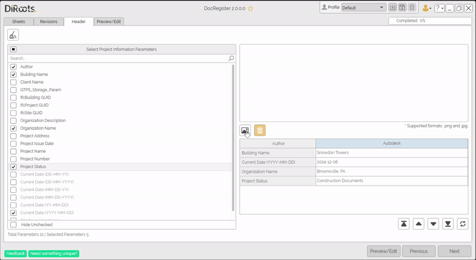

# Headers Tab
{: .no_toc }
In this tab choose the Project Information Parameters that will be used to build the header of the document to be published, as well as select an image to insert in that header.

## Table of contents
{: .no_toc .text-delta }

1. TOC
{:toc}

---

## Select Project Information Parameters

In this table, you can select the information parameters parameters to be included in the header section of the document. Use the checkboxes to select the parameters.

Some additional environment variables are appended, shown in gray foreground, such as Date and Windows User Name.

1. Use the **Search** bar to quickly locate a parameter by name.
2. In the **Available Parameters** panel:
   - Use the checkboxes to select the desired parameters.
   - The selected parameters will automatically appear in the **Selected Parameters Table** on the right.
3. To hide the parameters you haven’t selected, check the **Hide Unchecked** box at the bottom of the panel.

  
Note: the version on the image may not reflect the [latest version of DocRegister](https://diroots.com/revit-plugins/revit-to-pdf-dwg-dgn-dwf-nwc-ifc-and-images-with-prosheets/).

### Parameters Preview:

On this table you can organize the selected parameters and customize their appearance:
#### Action Buttons

- **Reorder Parameters**: Use the arrow buttons below the table to rearrange the order of selected parameters. The order you set here will determine their placement in the final document.
- **Sort Parameters**: Use the sort parameters button to automatically sort the parameters in alphabetical order

#### Context Menu
- **Edit Parameter Name**: Overrides the parameter's name when exporting
- **Undo Name Change**: Reverts the name to the original
- **Align Left/Right/Center**: Aligns the text of the column's content

  
Note: the version on the image may not reflect the [latest version of DocRegister](https://diroots.com/revit-plugins/revit-to-pdf-dwg-dgn-dwf-nwc-ifc-and-images-with-prosheets/).

---

## Add an Image to the Header

You can add an image to personalize or brand the header section of the document. Supported image formats are `.png` and `.jpg`.

1. Click the **Image Icon** below the Selected Parameters Table to upload an image.
2. Once uploaded, the image will be displayed in the preview area.
3. To remove the image, click on the **Trash Icon** next to the preview.

  
Note: the version on the image may not reflect the [latest version of DocRegister](https://diroots.com/revit-plugins/revit-to-pdf-dwg-dgn-dwf-nwc-ifc-and-images-with-prosheets/).

