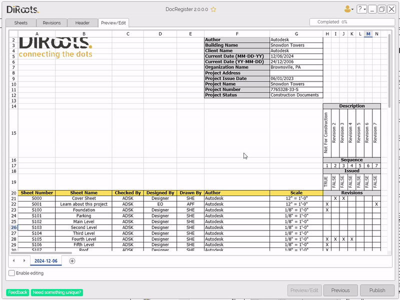

# Preview/Edit Tab
{: .no_toc }

The Preview tab is where you'll be able to preview the document before exporting. 

## Table of contents
{: .no_toc .text-delta }

1. TOC
{:toc}

---

## Preview/Edit

Use this tab at any point to review how the document will be created.
You have the option to "Enable editing" on the file, and make changes to it before exporting.
Keep in mind that any changes you make here will be lost if you return to a previous tab.

After reviewing and editing you can "Publish" the document. You will be prompted with a dialog to choose a folder where the document will be saved.

  
Note: the version on the image may not reflect the [latest version of DocRegister](https://diroots.com/revit-plugins/revit-to-pdf-dwg-dgn-dwf-nwc-ifc-and-images-with-prosheets/).