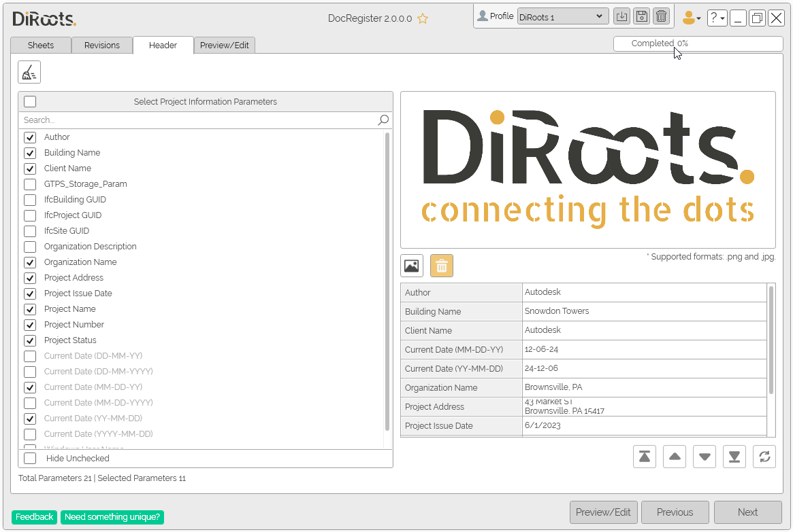

# Profiles
{: .no_toc }

## Table of contents
{: .no_toc .text-delta }

1. TOC
{:toc}

---

## What's saved in the profile

The following settings are saved in the profiles.

- Sheets Parameters and their customizations
- Revisions Properties and their customizations
- Project Parameters and their customizations
- Added image

## Creating Profiles

DocRegister profiles make it easy to save your settings and reuse them later. It is also a handy way for BIM Managers to create standard rules (e.g., filename conventions) and share them across the organization.

Steps:
1. In the window header, click on the "Save As" dropdown button next to the profiles list.

2. Name the profile (give it a meaningful name because this is the name that will show up in the profiles list)

3. Choose the location to save it.

4. Click on the "Save" button to create the profile.


<sub>Note: the version on the image may not reflect the [latest version of DocRegister](https://diroots.com/revit-plugins/revit-to-pdf-dwg-dgn-dwf-nwc-ifc-and-images-with-DocRegister/).</sub>

```
Tip for BIM Managers!  

Create the profiles in a network location to allow other users to import them.
See the "Importing Profiles" section to teach users how to pull profiles from a network location.
```

## Importing Profiles

DocRegister profiles make it easy to import existing profiles to stay compliant with your company standards (e.g., profiles in a network location).

Steps:
1. In the window header, click on the Import button next to the profiles list.

2. Use the File Explorer Dialog to find the profile (e.g., in a shared folder, location network, or local computer)

3. Click on the “Open” button to import the profile.

 
<sub>Note: the version on the image may not reflect the [latest version of DocRegister](https://diroots.com/revit-plugins/revit-to-pdf-dwg-dgn-dwf-nwc-ifc-and-images-with-DocRegister/).</sub>

## Deleting Profiles

Steps:
1. In the window header, select the profile you wish to delete from the dropdown list.

2. Click on the dustbin icon next to the profiles list.

3. Confirm.

