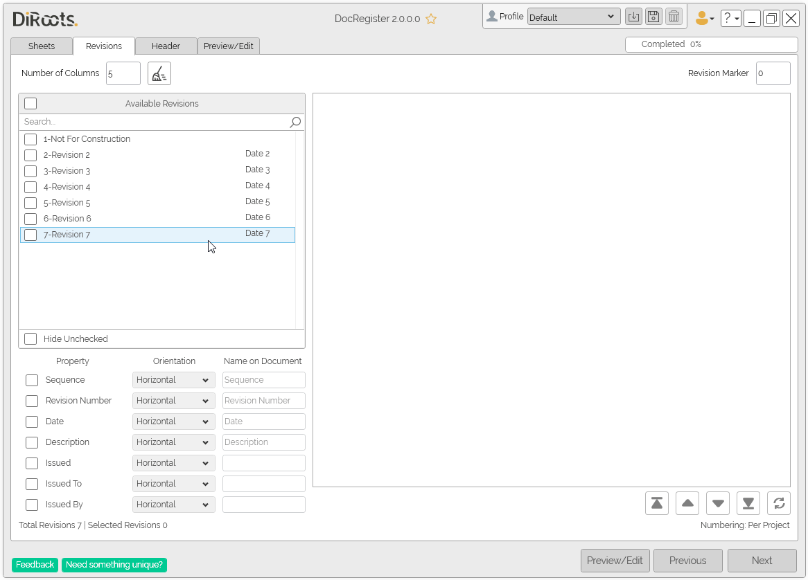
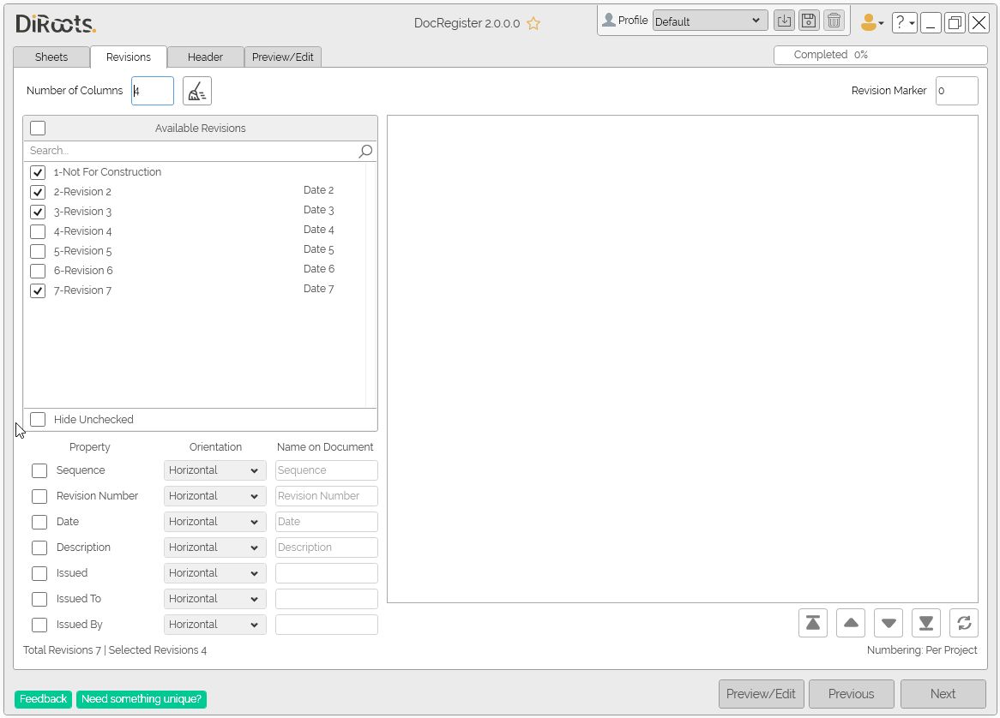
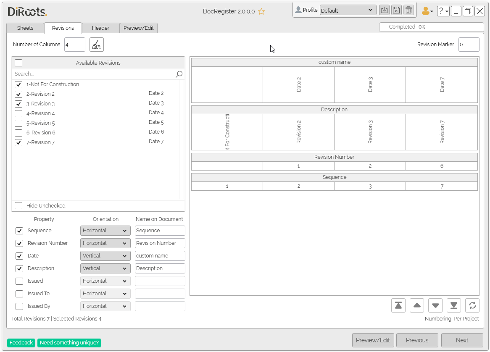
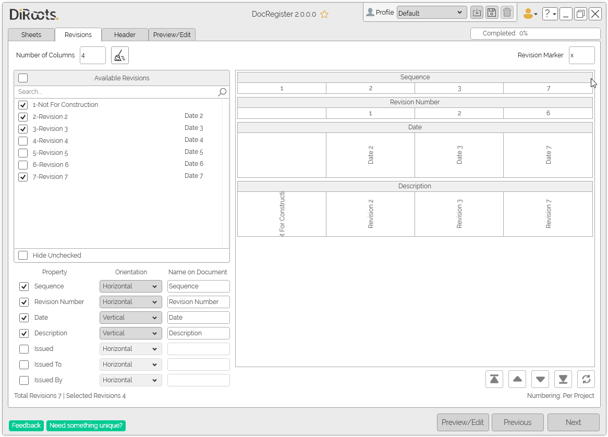

# Revisions Tab
{: .no_toc }
The Revisions tab is where you'll select the revisions to be exported. DocRegister has options to filter and search to ease the selection. It also allows you to customize what properties will be exported, their orientations, override their names and define a custom revision marker.

## Table of contents
{: .no_toc .text-delta }

1. TOC
{:toc}

---

## Available Revisions

In the first table will display all the revisions in the current project and linked files (if selected). Select the Revisions to add to the document.

### Number of Columns

Use this field to assign the number of revision columns for your document. Please note that if you select a number higher than the number of revisions selected, the extra columns will be empty in the published document.

1. Use the **Search** bar to filter the revisions by name or date.

2. Use the checkboxes to select the desired revisions.

3. To hide the revisions you haven’t selected, check the **Hide Unchecked** box at the bottom of the panel.

  
Note: the version on the image may not reflect the [latest version of DocRegister](https://diroots.com/revit-plugins/revit-to-pdf-dwg-dgn-dwf-nwc-ifc-and-images-with-prosheets/).

---

## Properties

In this fields to select the Revisions Properties to add to the document. The selected properties will be shown in the table on the right.

1. **Orientation** - select the desired orientation to show the values of this property in the table, either Vertical or Horizontal.

2. **Name on Document** - override the name of the property that will be shown in the document. This change will not affect the current project in Revit.

  
Note: the version on the image may not reflect the [latest version of DocRegister](https://diroots.com/revit-plugins/revit-to-pdf-dwg-dgn-dwf-nwc-ifc-and-images-with-prosheets/).

---
## Table

1. Use the arrows below to sort the properties into the desired order.

2. Click the sort button to sort alphabetically.

  
Note: the version on the image may not reflect the [latest version of DocRegister](https://diroots.com/revit-plugins/revit-to-pdf-dwg-dgn-dwf-nwc-ifc-and-images-with-prosheets/).

### Revision Marker

This field will only be activated if the numbering system for the revisions in the project is selected as "Per Project". Choose a character to mark which revisions are applied to each sheet in the document.

### Clear

Use the "Clear" button to reset all selected Revisions and Properties.

  
Note: the version on the image may not reflect the [latest version of DocRegister](https://diroots.com/revit-plugins/revit-to-pdf-dwg-dgn-dwf-nwc-ifc-and-images-with-prosheets/).
