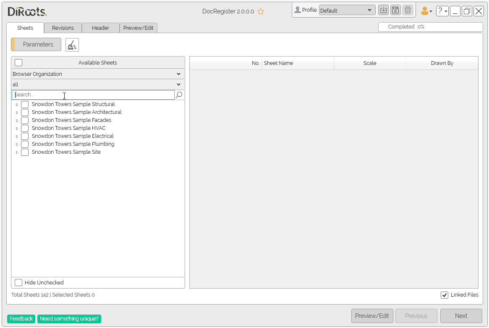

# Sheets Tab
{: .no_toc }
The Sheets tab is where you select the sheets to place in the general revision document. In this tab, you can also choose the Parameters of the sheets to be assigned to the document.

## Table of contents
{: .no_toc .text-delta }

1. TOC
{:toc}

---

## Available Sheets

Select sheets for the revision document by using the checkboxes in this table.
- Organize Sheets according to the Browser Organization or using a Sheet List.
- Use the **Search** bar to quickly locate a sheet by name or number.
- Use the checkboxes to select the desired sheets.
- The selected sheets will automatically appear in the table on the right.
- Use the **Hide Unchecked** box at the bottom of the panel to hide the sheets you haven’t selected.
- Check the **Linked Files** option to include sheets from linked files.

   
<sub>Note: the version on the image may not reflect the [latest version of DocRegister](https://diroots.com/revit-plugins/revit-to-pdf-dwg-dgn-dwf-nwc-ifc-and-images-with-prosheets/).</sub>

---

## Parameters

Click on the "Parameters" button to select sheet parameters to include in the revisions document.

1. Select Parameters in the "Available Parameters" table and add to the second table (Selected Parameters).

2. Use the arrows to add or remove parameters, or double-click.

3. Use the arrows below to sort the parameters to organize the columns in the document.

  
<sub>Note: the version on the image may not reflect the [latest version of DocRegister](https://diroots.com/revit-plugins/revit-to-pdf-dwg-dgn-dwf-nwc-ifc-and-images-with-prosheets/).</sub>

```yaml
# Note:
The "Sheet Name" and "Sheet Number" parameters are selected by default.
Note that the selected parameters will be shown in the second table.
```

### Merged Parameters

This window allows you to merge several parameters into just one column by selecting the parameters you want to merge and defining separators, prefixes and suffixes between them.


  
<sub>Note: the version on the image may not reflect the [latest version of DocRegister](https://diroots.com/revit-plugins/revit-to-pdf-dwg-dgn-dwf-nwc-ifc-and-images-with-prosheets/).</sub>

### Columns Settings

Right-click on the column headers of the selected parameters to make some edits.

1. Edit Parameter Name - this tool allows the user to change the name of the parameter to be published in the document, but does not change the parameter in the project.

2. Undo Name Change - as long as the user has changed the name of the parameter in the document, they can undo the change and go back to the original name.

3. Align Column Content - align Left, align Right and center.

  
<sub>Note: the version on the image may not reflect the [latest version of DocRegister](https://diroots.com/revit-plugins/revit-to-pdf-dwg-dgn-dwf-nwc-ifc-and-images-with-prosheets/).</sub>

#### Parameters in the document

Note that the sheet parameters will appear in the yellow columns.

### Clear

Use the "Clear" button to reset the selected Sheets and Parameters.
