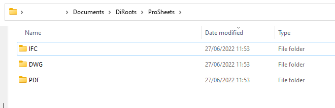
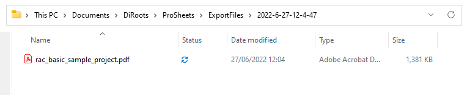
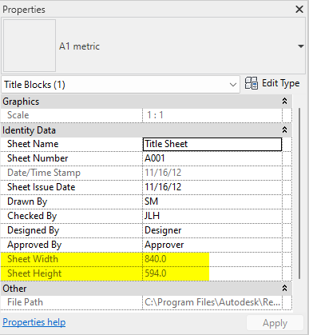
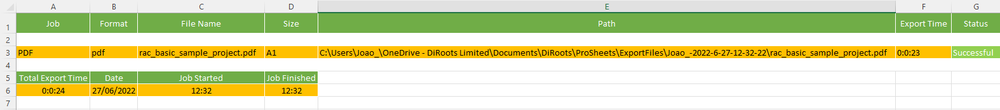

# Export Tab
{: .no_toc }

## Table of contents
{: .no_toc .text-delta }

1. TOC
{:toc}

---

## User Interface Overview

  
<sub>Note: the version on the image may not reflect the [latest version of ProSheets](https://diroots.com/revit-plugins/revit-to-pdf-dwg-dgn-dwf-nwc-ifc-and-images-with-prosheets/).</sub>

## Export Location

ProSheets allows you to set an export path. The export path can be in your local computer or in a network location (i.e.: a path to a folder on a shared network drive).  
This path is the will be used to save the files outputed by ProSheets.

### Save all files in the same folder location

By selecting the option 'Save all files in the same folder location', ProSheets will create all files, regardless of the file format, in the same folder.

```yaml
'Saving all files in the same folder location' is the default option. 
```

### Save and split files by file format

By selecting the option 'Save and split files by file format', ProSheets will create subfolder to organize the files by file format (e.g., PDF, DWG, IFC, etc.).

  

### Environment variables

ProSheets allows you to use environment variables to set up the export path.

#### Supported environment variables:
- %UserName% - current windows username
- %Y - the current year (e.g., 2024)
- %YY - the current year (e.g., 24)
- %YYYY - the current year (e.g., 2024)
- %m - the current month without padding zero (e.g., 6)
- %mm - the current month with padding zero (e.g., 06)
- %d - the current day without padding zero (e.g., 5)
- %dd - the current day with padding zero (e.g., 05)
- %H - the current hour without padding zero (e.g., 8)
- %HH - the current hour with padding zero (e.g., 08)
- %M - the current minute without padding zero (e.g., 1)
- %MM - the current minute with padding zero (e.g., 01)
- %S - the current seconds without padding zero (e.g., 4)
- %SS - the current seconds with padding zero (e.g., 04)
- %DrawingName% - the filename
- %IssueDate% - the Sheet Issue Date builtin parameter

Pratical Example.  

Input:  

C:\Users\Joao_\OneDrive - DiRoots Limited\Documents\DiRoots\ProSheets\ExportFiles\%UserName%-%Y-%m-%d-%H-%M-%S  

Output:  



#### Organize folders

You can also select the radio buttons to save all files in the same folder location or split files by file format.

## Paper Size and Orientation

By default ProSheets automically detects the paper size and orientation of your sheets. The auto-detection feature runs automically and it is based on the Title Block dimensions (the built-in parameters Sheet Width and Sheet Heigh).

  

### Manually set the Paper Size and Orientation

The auto-detection feature is handy in most scenarios but sometimes we may we want to set a specific size and orientation. 

Steps:
1. Select the sheets/views you want to change the paper size and orientation
2. Click on the dropdown list to "Set Paper Size" and "Set Orientation"
3. Right-click to "Set Paper Size" and "Set Orientation"

  
<sub>Note: the version on the image may not reflect the [latest version of ProSheets](https://diroots.com/revit-plugins/revit-to-pdf-dwg-dgn-dwf-nwc-ifc-and-images-with-prosheets/).</sub>

```yaml
#Note:
Also use the right-click to "Open Sheet/View" and to "Remove Sheet/View from Queue".
```

  
<sub>Note: the version on the image may not reflect the [latest version of ProSheets](https://diroots.com/revit-plugins/revit-to-pdf-dwg-dgn-dwf-nwc-ifc-and-images-with-prosheets/).</sub>

## Generate Export Report

ProSheets also allows you to generate export reports. The report can be generated in .XLSX (a.k.a Excel spreadsheet) or .CSV (comma-separated values).  

  
<sub>Note: the version on the image may not reflect the [latest version of ProSheets](https://diroots.com/revit-plugins/revit-to-pdf-dwg-dgn-dwf-nwc-ifc-and-images-with-prosheets/).</sub>

Information included in the report:
- List of the files that were created (filename, file format, location path, export time, status)
- Total export time and date of the export job

Example:
  

---

## Scheduling Assistant

The Scheduling Assistant tool allows you to define the views/sheets and their settings to be printed and schedule automatic printing at an exact date and time, or repeat.

```yaml
#Note:
Note that for automatic printing to take occur with this tool active, the project must be open in Revit at the appointed time. 
```

### Schedule Publish

To activate this function, click on the “Schedule Assistan” button to activate the automatic printing settings.

1. Click on the first dropdown list to "Choose Starting Date".
2. Next, "Choose Time".
3. The third drop-down menu defines whether the printout will be repeated or not. You can opt for a monthly or weekly repeat.
  - If the user chooses “Weekly”, they must then choose the days of the week on which they want the printout to be made. 
  - Use the checkbox to select the days.

  
<sub>Note: the version on the image may not reflect the [latest version of ProSheets](https://diroots.com/revit-plugins/revit-to-pdf-dwg-dgn-dwf-nwc-ifc-and-images-with-prosheets/).</sub>

### Scheduling Assistant Legend

Note that in the bottom bar of ProSheets there is a legend indicating whether the Scheduling Assistant is active or not.

  
<sub>Note: the version on the image may not reflect the [latest version of ProSheets](https://diroots.com/revit-plugins/revit-to-pdf-dwg-dgn-dwf-nwc-ifc-and-images-with-prosheets/).</sub>

#### Scheduling Assistant Status

When you activate the Scheduling Assistant, the tool records all the current settings. If the user makes changes later, the status will indicate that the Scheduling Assistant is not updated according to the latest changes. 

  
<sub>Note: the version on the image may not reflect the [latest version of ProSheets](https://diroots.com/revit-plugins/revit-to-pdf-dwg-dgn-dwf-nwc-ifc-and-images-with-prosheets/).</sub>

#### Scheduling Assistant Update

Whenever the Scheduling Assistant is out of date, the “Update” button becomes active. When clicked, the plugin displays a report of the changes made, so that the user can choose to continue or go back.

  
<sub>Note: the version on the image may not reflect the [latest version of ProSheets](https://diroots.com/revit-plugins/revit-to-pdf-dwg-dgn-dwf-nwc-ifc-and-images-with-prosheets/).</sub>

---

If you want to find out more about ProSheets and explore detailed tutorials on how to use it, visit our YouTube channel. There, you'll find a series of videos that can help answer questions and improve your knowledge. Be sure to check it out and subscribe to keep up to date with our news and tips!

[DiRoots Channel](https://www.youtube.com/@DiRootsNews){: .btn .btn-di-orange }
