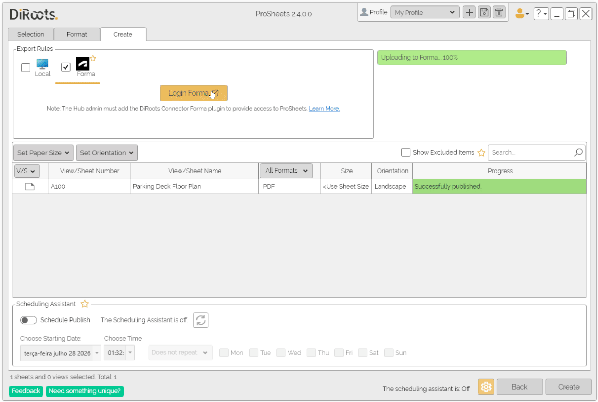
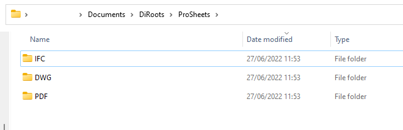
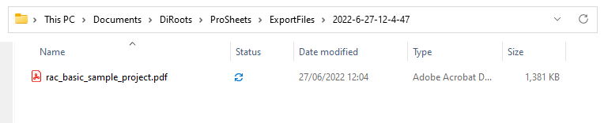
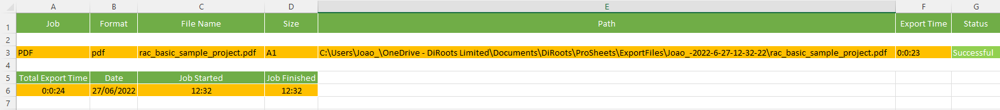
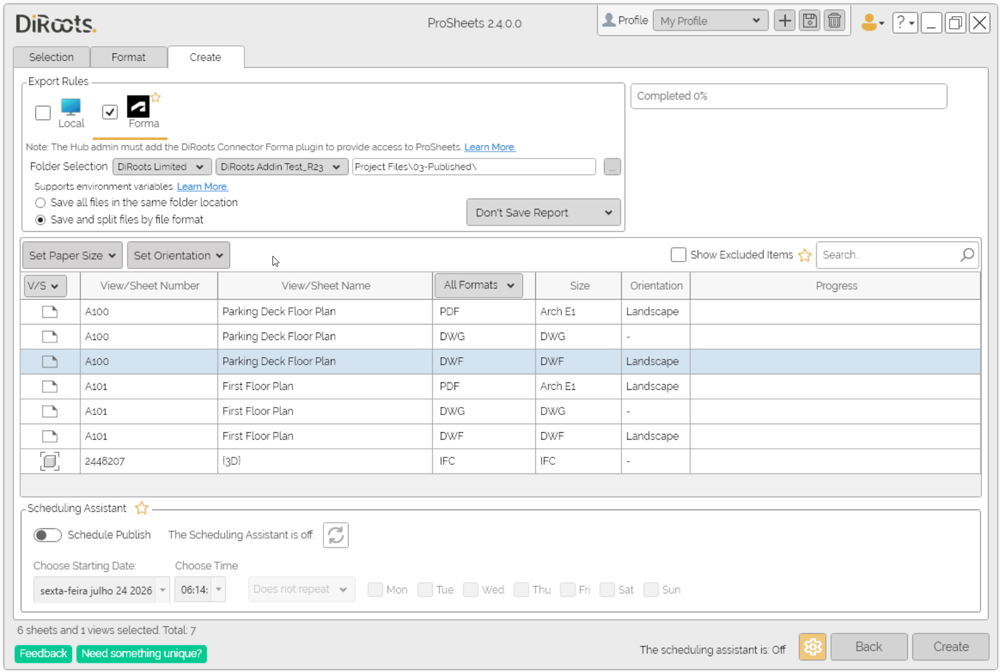
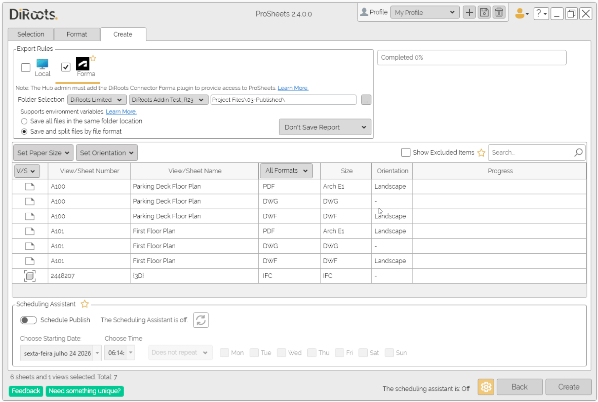
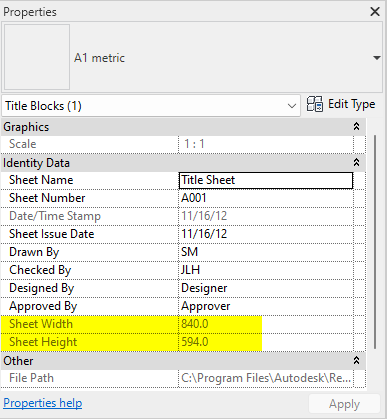

# Export Tab
{: .no_toc }

## Table of contents
{: .no_toc .text-delta }

1. TOC
{:toc}

---

## User Interface Overview

  
<sub>Note: the version on the image may not reflect the [latest version of ProSheets](https://diroots.com/revit-plugins/revit-to-pdf-dwg-dgn-dwf-nwc-ifc-and-images-with-prosheets/).</sub>

## Export Location

ProSheets allows you to export files locally, to Autodesk Forma, or to both destinations in the same export job.

Use the checkboxes under "Export Rules" to select "Local", "Forma", or both. Select the corresponding tab to configure each export location. When both options are selected, ProSheets saves the generated files to the configured local folder and uploads them to the selected Forma folder in the same export job.

### Local

Use "Local" to export files to a folder on your computer or to a shared network drive.

Select the "Local" checkbox and open the "Local" tab. Use the "Folder Selection" field to enter the export path, or click the ellipsis button (...) to select a folder.

### Forma

ProSheets can export files to Autodesk Forma Document Management. Select the option "Forma" and choose a Hub, Project, and folder from your Forma account as the export location.

#### Install and authorize the DiRoots Connector

Before ProSheets users can export files to an Autodesk Forma Hub (previously called an account), a Hub Administrator must install and authorize the DiRoots Connector for that Hub.

Steps for Hub Administrators:

1. Sign in to Autodesk Forma and open "Hub Admin" for the required Hub.
2. Open "Apps".
3. Select "DiRoots Connector for Autodesk Forma" from the App Gallery.
4. Click "Install".
5. Review the requested permissions, then click "Authorize and Install".

  

Install the connector separately for each Hub where ProSheets will be used. ProSheets users can then follow the steps below to log in to Forma.

```yaml
#Note:
Autodesk previously used the terms "account" and "Account Admin" for "Hub" and "Hub Admin"
```

#### Login to Forma

Steps:

1. Select the "Forma" checkbox and open the "Forma" tab.
2. Click on "Login to Forma" and log in with your Autodesk account in the browser window.
3. Return to ProSheets.

After logging in, ProSheets will display the Forma Hubs and Projects available to your Autodesk account.

If a Hub is not available, contact your Hub Administrator to confirm that the DiRoots Connector has been added and that you have access to the Hub.

#### Folder selection

After logging in, select the Hub, Project, and folder where the exported files will be saved.

Steps:

1. Select a Hub from the dropdown list.
2. Select a Project from the dropdown list.
3. Click the ellipsis button (...) next to the folder path to open the Forma Explorer.
4. Browse the Autodesk Docs folder structure and select the destination folder.

The Forma Explorer allows you to expand and collapse folders and displays information such as name, version, last updated date, updated by, and description.

After selecting a folder, the Forma path will be displayed in the Create tab.

After ProSheets generates each export, it uploads the file to the selected Forma folder. If a file with the same name already exists, the upload creates a new version of the existing file.

  
<sub>Note: the version on the image may not reflect the [latest version of ProSheets](https://diroots.com/revit-plugins/revit-to-pdf-dwg-dgn-dwf-nwc-ifc-and-images-with-prosheets/).</sub>

### Folder organization

Use the radio buttons to choose how ProSheets organizes the exported files.

- "Save all files in the same folder location" - saves all exported files in the selected folder.
- "Save and split files by file format" - creates a subfolder for each exported file format.

  

### Environment variables

You can use environment variables to build the saving path.

#### Supported environment variables:

- %UserName% - current Windows username
- %Y - the current year (e.g., 2024)
- %YY - the current year (e.g., 24)
- %YYYY - the current year (e.g., 2024)
- %m - the current month without padding zero (e.g., 6)
- %mm - the current month with padding zero (e.g., 06)
- %d - the current day without padding zero (e.g., 5)
- %dd - the current day with padding zero (e.g., 05)
- %H - the current hour without padding zero (e.g., 8)
- %HH - the current hour with padding zero (e.g., 08)
- %M - the current minute without padding zero (e.g., 1)
- %MM - the current minute with padding zero (e.g., 01)
- %S - the current seconds without padding zero (e.g., 4)
- %SS - the current seconds with padding zero (e.g., 04)
- %DrawingName% - the filename
- %IssueDate% - the Sheet Issue Date builtin parameter

Local export example:

Input:  

C:\Users\Joao_\OneDrive - DiRoots Limited\Documents\DiRoots\ProSheets\ExportFiles\%UserName%-%Y-%m-%d-%H-%M-%S  

Output:  



### Generate Export Report

Use the report dropdown to choose whether ProSheets generates a report after the export. The report can be generated in .XLSX (Excel spreadsheet) or .CSV (comma-separated values).

The same report option applies to Local and Forma exports.

  
<sub>Note: the version on the image may not reflect the [latest version of ProSheets](https://diroots.com/revit-plugins/revit-to-pdf-dwg-dgn-dwf-nwc-ifc-and-images-with-prosheets/).</sub>

Information included in the report:
- List of the files that were created (filename, file format, location path, export time, status)
- Total export time and date of the export job

For Forma exports, the report also includes the selected Forma path.

Example:
  

## Manage the export queue

Use the search and filters in the Create tab to find rows in the export table without changing what ProSheets exports.

### Search

Enter part of a sheet or view number or name in the search field. ProSheets displays rows with matching values in the "View/Sheet Number" or "View/Sheet Name" columns.

### Filter views, sheets, and formats

Use the Views/Sheets (V/S) filter in the column header to display rows by item type:

- "All Views/Sheets": Displays both sheets and views.
- "Sheets": Displays only sheets.
- "Views": Displays only views.

Use the format filter to display rows for one file format. The dropdown includes only the formats selected in the Format tab. Select "All Formats" to clear the format filter.

You can combine the search, Views/Sheets, and format filters.

> **Important:** Filters only change which rows are displayed. Hidden items remain in the export queue and will still be exported. To stop an item from being exported, remove it from the queue.

  
<sub>Note: the version on the image may not reflect the [latest version of ProSheets](https://diroots.com/revit-plugins/revit-to-pdf-dwg-dgn-dwf-nwc-ifc-and-images-with-prosheets/).</sub>

### Exclude and restore export items

To exclude items from the export, select one or more rows, right-click the selection, and select "Remove item(s) from queue". Removed items are not exported.

"Show Excluded Items" is a Premium feature. When selected, the excluded items are shown in halftone. To add them back to the export queue, select them, right-click the selection, and select "Restore item(s) to queue". Restored items are included in the export again.

  
<sub>Note: the version on the image may not reflect the [latest version of ProSheets](https://diroots.com/revit-plugins/revit-to-pdf-dwg-dgn-dwf-nwc-ifc-and-images-with-prosheets/).</sub>

## Paper Size and Orientation

By default ProSheets automically detects the paper size and orientation of your sheets. The auto-detection feature runs automically and it is based on the Title Block dimensions (the built-in parameters Sheet Width and Sheet Heigh).

  

### Manually set the Paper Size and Orientation

The auto-detection feature is handy in most scenarios but sometimes we may we want to set a specific size and orientation. 

Steps:
1. Select the sheets/views you want to change the paper size and orientation
2. Click on the dropdown list to "Set Paper Size" and "Set Orientation"
3. Right-click to "Set Paper Size" and "Set Orientation"

  
<sub>Note: the version on the image may not reflect the [latest version of ProSheets](https://diroots.com/revit-plugins/revit-to-pdf-dwg-dgn-dwf-nwc-ifc-and-images-with-prosheets/).</sub>

```yaml
#Note:
Right-click a row and select "Open Sheet" or "Open View" to open it in Revit.
```

  
<sub>Note: the version on the image may not reflect the [latest version of ProSheets](https://diroots.com/revit-plugins/revit-to-pdf-dwg-dgn-dwf-nwc-ifc-and-images-with-prosheets/).</sub>

---

## Scheduling Assistant

The Scheduling Assistant tool allows you to define the views/sheets and their settings to be printed and schedule automatic printing at an exact date and time, or repeat.

```yaml
#Note:
Note that for automatic printing to take occur with this tool active, the project must be open in Revit at the appointed time. 
```

### Schedule Publish

To activate this function, click on the “Schedule Assistant” button to activate the automatic printing settings.

1. Click on the first dropdown list to "Choose Starting Date".
2. Next, "Choose Time".
3. The third drop-down menu defines whether the printout will be repeated or not. You can opt for a monthly or weekly repeat.
  - If the user chooses “Weekly”, they must then choose the days of the week on which they want the printout to be made. 
  - Use the checkbox to select the days.

  
<sub>Note: the version on the image may not reflect the [latest version of ProSheets](https://diroots.com/revit-plugins/revit-to-pdf-dwg-dgn-dwf-nwc-ifc-and-images-with-prosheets/).</sub>

### Scheduling Assistant Legend

Note that in the bottom bar of ProSheets there is a legend indicating whether the Scheduling Assistant is active or not.

  
<sub>Note: the version on the image may not reflect the [latest version of ProSheets](https://diroots.com/revit-plugins/revit-to-pdf-dwg-dgn-dwf-nwc-ifc-and-images-with-prosheets/).</sub>

#### Scheduling Assistant Status

When you activate the Scheduling Assistant, the tool records all the current settings. If the user makes changes later, the status will indicate that the Scheduling Assistant is not updated according to the latest changes. 

  
<sub>Note: the version on the image may not reflect the [latest version of ProSheets](https://diroots.com/revit-plugins/revit-to-pdf-dwg-dgn-dwf-nwc-ifc-and-images-with-prosheets/).</sub>

#### Scheduling Assistant Update

Whenever the Scheduling Assistant is out of date, the “Update” button becomes active. When clicked, the plugin displays a report of the changes made, so that the user can choose to continue or go back.

  
<sub>Note: the version on the image may not reflect the [latest version of ProSheets](https://diroots.com/revit-plugins/revit-to-pdf-dwg-dgn-dwf-nwc-ifc-and-images-with-prosheets/).</sub>

---

If you want to find out more about ProSheets and explore detailed tutorials on how to use it, visit our YouTube channel. There, you'll find a series of videos that can help answer questions and improve your knowledge. Be sure to check it out and subscribe to keep up to date with our news and tips!

[DiRoots Channel](https://www.youtube.com/@DiRootsNews){: .btn .btn-di-orange }
