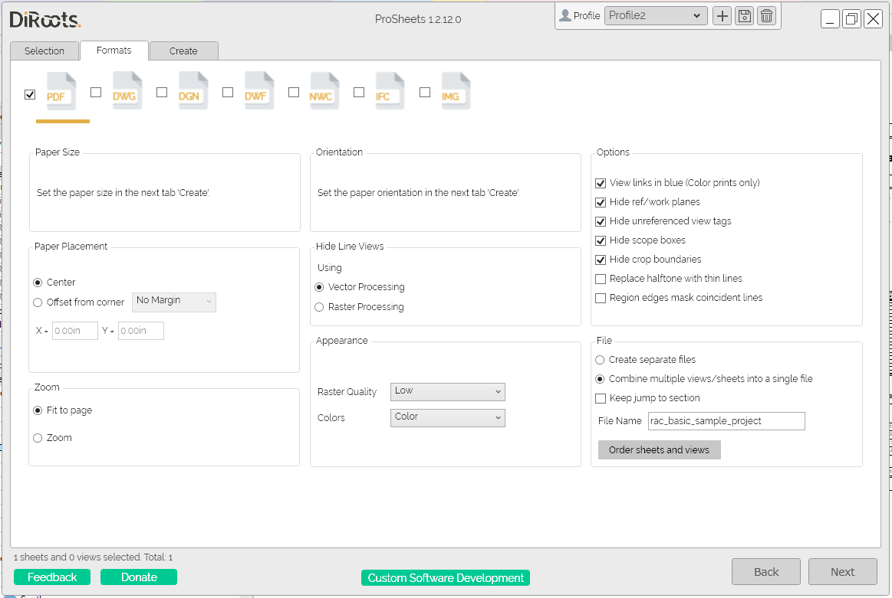
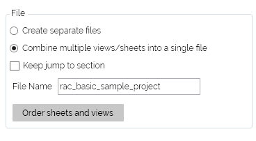
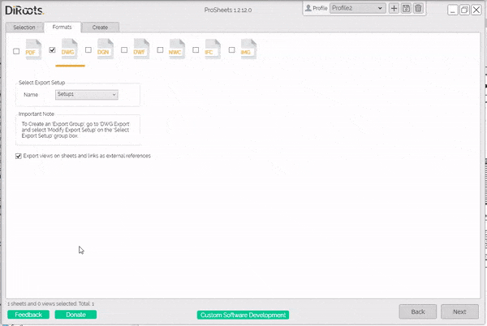

# Formats Tab
{: .no_toc }

## Table of contents
{: .no_toc .text-delta }

1. TOC
{:toc}

---

## Supported File Formats

ProSheets allows you to batch Export Sheets/Views to PDF, DWG, DGN, DWF, NWC, IFC, and IMG (JPEG, PNG, TIFF)

  
Note: the version on the image may not reflect the [latest version of ProSheets](https://diroots.com/revit-plugins/revit-to-pdf-dwg-dgn-dwf-nwc-ifc-and-images-with-prosheets/).

## PDF Settings

ProSheets uses the Revit engine and a custom instance of PDF24 printer (diroots.prosheets printer) to export to PDF. ProSheets supports all Revit to PDF options plus some additional handy features.

  
Note: the version on the image may not reflect the [latest version of ProSheets](https://diroots.com/revit-plugins/revit-to-pdf-dwg-dgn-dwf-nwc-ifc-and-images-with-prosheets/).

Supported settings:
- **all PDF Revit settings** (paper placement, oritantion, zoom, vector and raster processing, etc.)
- additional settings for combined PDFs
    - order views and sheets
    - different page sizes in the same PDF
	
	**Note:** the additional settings work only if the 'Keep jumped to section' checkbox is unchecked.  
	
	  

## DWG Settings

ProSheets uses the Revit engine to export to DWG. All the DWG settings will be read from the DWG export setups created in Revit.

Steps:
1. In Revit UI go to File -> Export -> DWG and create a new DWG/DWF export setup as per your requirements (if you don't know how to create/modify a DWG/DWF setup, read this [article](https://knowledge.autodesk.com/support/revit/learn-explore/caas/CloudHelp/cloudhelp/2019/ENU/Revit-DocumentPresent/files/GUID-E8443B4B-D55B-4630-BEE3-D2D8628CA17B-htm.html))
2. Use the dropdown to switch between the existing DWG setups. If you created the setup with ProSheets opened, you may need to close and reopen it to see the new setup in the list.  

  
Note: the version on the image may not reflect the [latest version of ProSheets](https://diroots.com/revit-plugins/revit-to-pdf-dwg-dgn-dwf-nwc-ifc-and-images-with-prosheets/).

## DGN Settings

ProSheets uses the Revit engine to export to DGN. All the DGN settings will be read from the DGN export setups created in Revit.

Steps:
1. In Revit UI go to File -> Export -> DGN and create a new DGN export setup as per your requirements (if you don't know how to create/modify a DGN setup, read this [article](https://knowledge.autodesk.com/support/revit/learn-explore/caas/CloudHelp/cloudhelp/2021/ENU/Revit-DocumentPresent/files/GUID-253B99CA-09C0-456E-B260-E69F5C14F793-htm.html))
2. Use the dropdown to switch between the existing DGN setups. If you created the setup with ProSheets opened, you may need to close and reopen it to see the new setup in the list.  

  
Note: the version on the image may not reflect the [latest version of ProSheets](https://diroots.com/revit-plugins/revit-to-pdf-dwg-dgn-dwf-nwc-ifc-and-images-with-prosheets/).

## DWF Settings

Content

## NWC Settings

Content

## IFC Settings

Content

## Images Settings

Content
