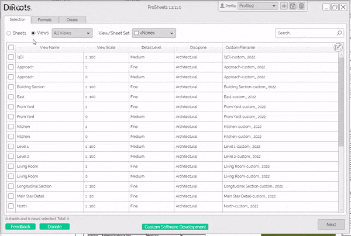
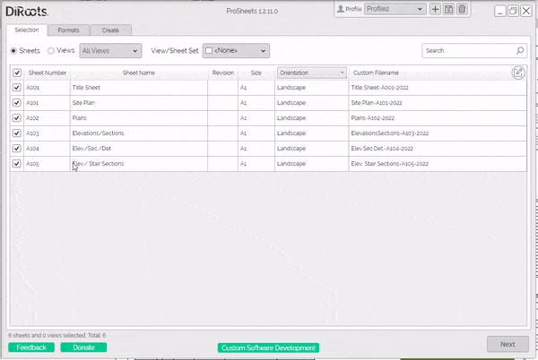

# Selection Tab
{: .no_toc }
The Selection tab is where you'll select the sheets and views to be exported and the file naming rules. ProSheets has options to sort, filter, and search to ease the selection. Plus, it has an advanced naming rule builder that allows you to customize the filenames.
## Table of contents
{: .no_toc .text-delta }

1. TOC
{:toc}

---

## Select Sheets and Views or View/Sheet Sets

The first step is to select the sheets and views to be exported.  

Steps:

1. Click radio buttons to switch between sheets and views. 

```yaml
The 'Sheets' radio button will show the existing sheets in the project.  
The 'Views' radio button will show the existing views in the project.  
```

2. Use the checkboxes to select specific sheets/views or use the checkbox in the table header to select all sheets/views.




---

## Sort, Filter and Search

ProSheets has options to sort, filter, and search to ease the selection.

### Sort

Click on the table headers to sort the views/sheets by one of the available parameters.  


```yaml
# Note:  
The 5th column in sheet list contains a dropdown that allows you select to any other instance parameter available on your sheets.  
Examples - Current Review Date, Approved By, Appears on Sheet List, etc. 
The default is Orientation.
```
  



### Filter

Filtering options available:
1. Radio button to switch between sheets and views
2. Dropdown to filter by view type (e.g., 3D, Floor Plan, Section, Detail, etc.)
3. Dropdown with checkboxes to filter by view/sheet sets.


### Search

### Select View/Sheet Sets

---

## Naming Rules

Content

---